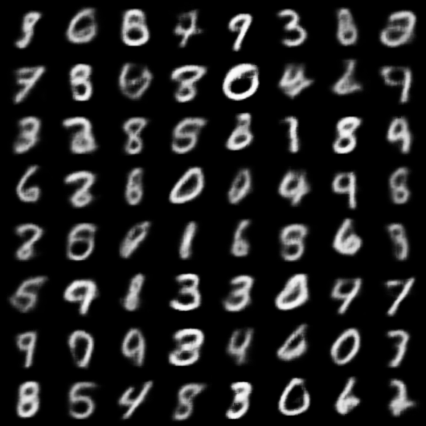

# Variational Autoencoder Example

This is an implementation of a Variational Autoencoder for generating MNIST images.

## Installation

To install the required dependencies, you can use
[Poetry](https://python-poetry.org/). Follow the steps below:

1. Install Poetry by following the instructions on the [official
   website](https://python-poetry.org/docs/#installation).

2. Clone the repository:

    ```sh
    git clone https://github.com/lyckantropen/vae.git
    cd vae
    ```

3. Install the dependencies:

    ```sh
    poetry install
    ```

4. To activate the virtual environment created by Poetry, use:

    ```sh
    poetry env activate
    ```

Now you are ready to run the Variational Autoencoder example.

## Training

To train the VAE model with MSE loss for 100 epochs, run the following command:

```sh
python scripts/train.py my_run --likelihood_type mse --num_epochs 100
```

## Generating samples

To generate samples using the pre-trained model from the previous example, run
the following command:

```sh
python scripts/generate.py --checkpoint_path runs/my_run/checkpoint.pth --num_samples 64 --output_path samples.png --grid_size 8
```

## Example generated samples

