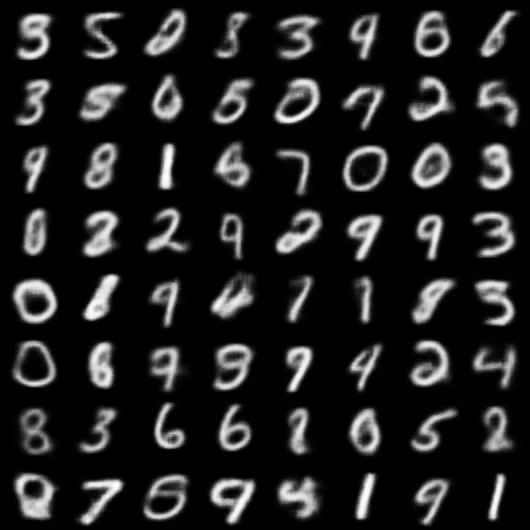

# Variational Autoencoder Example

This is an implementation of a Variational Autoencoder for generating MNIST images.

**Short explanation**: This model will generate **new, previously unseen
handwritten digits** based only on **random input** from a normal distribution.
I **don't tell it** which numbers to generate.

## Example generated samples



## Explanation

A Variational Autoencoder is a type of a generative model that attempts to learn
the distribution of the data by expressing it as a latent-variable model with
a Gaussian latent variable. Instead of blindly sampling the latent space in
hope for generating relevant samples, it jointly learns a parametrization of
the latent space along with a mapping from the latent space to the space of
generated samples, based on real examples.

The parametrization of the latent space is modeled using a contracting deep
convolutional network, the output of which is used to predict the mean and
variance of the latent space distribution.

The mapping from the latent space is modeled using an expanding deep
convolutional network that maps random samples from the latent space to images.


Once the mapping is learned, it is enough to feed **random** samples from a
multivariate normal distribution (Gaussian with zero mean and variance set to one)
**to the decoder** to generate meaningful images like the ones seen during
training.

The loss function of a Variational Autoencoder is constructed as the NELBO, i.e.
Negative Evidence Lower Bound. It consists of a **negative log-likelihood**
(which accounts for the reconstruction error) and the **Kullback-Leibler
divergence** (which measures how much additional information is necessary to map
samples from the encoder to samples from a normal distribution; also acts as a
regularizer).

I use the $\beta$-VAE formulation to allow for anneling of the KL term:

$$
\mathcal{L} = -\log p(x|z) + \beta D_{KL} [q(z|x)|p_z(z)]
$$


## Installation

To install the required dependencies, you can use
[Poetry](https://python-poetry.org/). Follow the steps below:

1. Install Poetry by following the instructions on the [official
   website](https://python-poetry.org/docs/#installation).

2. Clone the repository:

    ```sh
    git clone https://github.com/lyckantropen/vae.git
    cd vae
    ```

3. Install the dependencies:

    ```sh
    poetry install
    ```

4. To activate the virtual environment created by Poetry, use:

    ```sh
    poetry env activate
    ```

Now you are ready to run the Variational Autoencoder example.

## Training

To train the VAE model with MSE loss for 100 epochs, run the following command:

```sh
python scripts/train.py my_run --likelihood_type mse --num_epochs 100
```

## Print model information

To print the information of the pre-trained model
`pretrained/checkpoint_best.pth`, run the following command:

```sh
python scripts/generate.py --checkpoint_path pretrained/checkpoint_best.pth --info_only
```

## Generating samples

To generate samples using the pre-trained model from the previous example, run
the following command:

```sh
python scripts/generate.py --checkpoint_path pretrained/checkpoint_best.pth --num_samples 64 --output_path samples.png --grid_size 8
```

## Bibliography

* Doersch, C. (2021). _Tutorial on Variational Autoencoders_ (No. arXiv:1606.05908). arXiv. [https://doi.org/10.48550/arXiv.1606.05908](https://doi.org/10.48550/arXiv.1606.05908)
* Kingma, D. P., & Welling, M. (2019). An introduction to variational autoencoders. _Foundations and Trends® in Machine Learning_, _12_(4), 307–392. [https://doi.org/10.1561/2200000056](https://doi.org/10.1561/2200000056)
* Kingma, D. P., & Welling, M. (2022). _Auto-Encoding Variational Bayes_ (No. arXiv:1312.6114). arXiv. [https://doi.org/10.48550/arXiv.1312.6114](https://doi.org/10.48550/arXiv.1312.6114)
